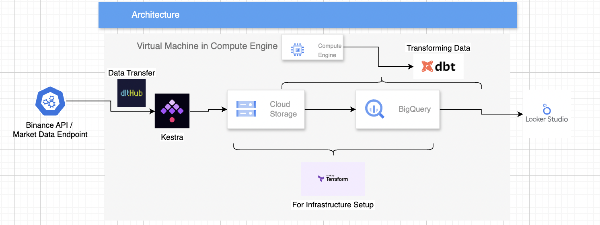
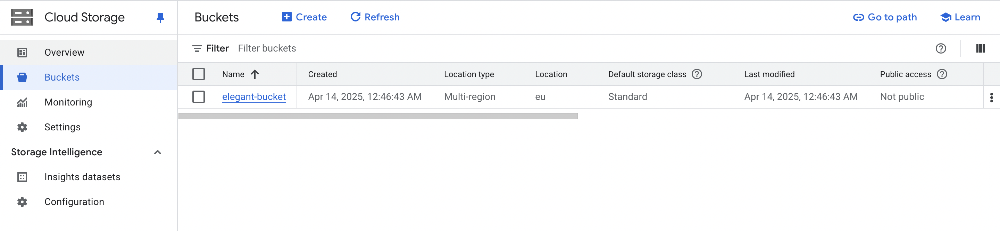
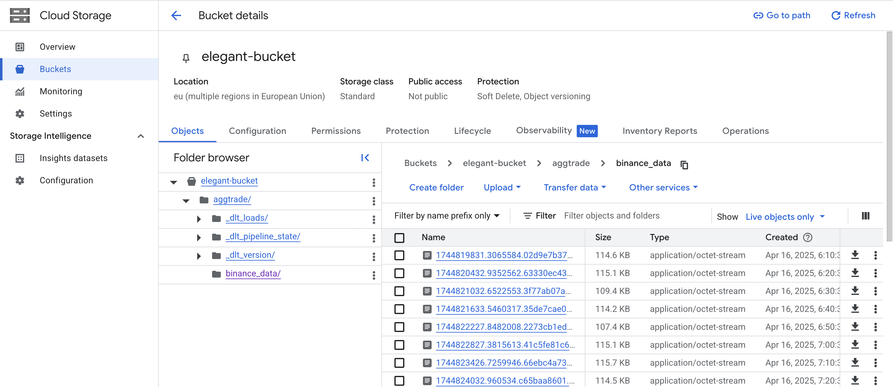
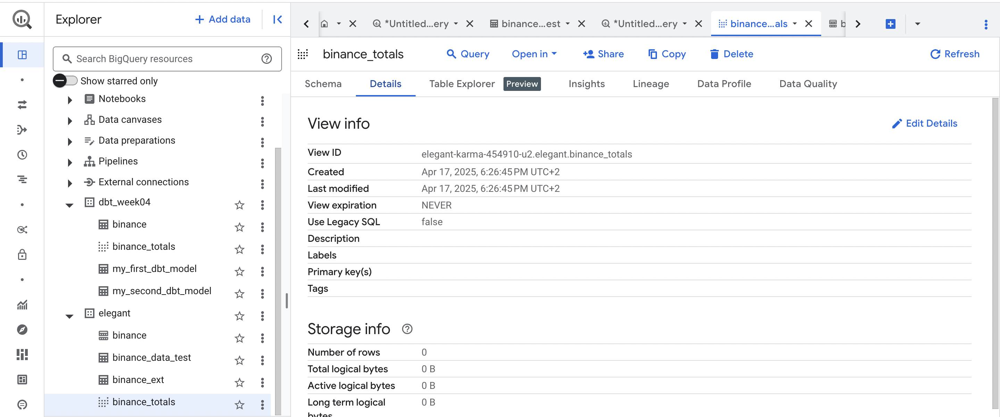
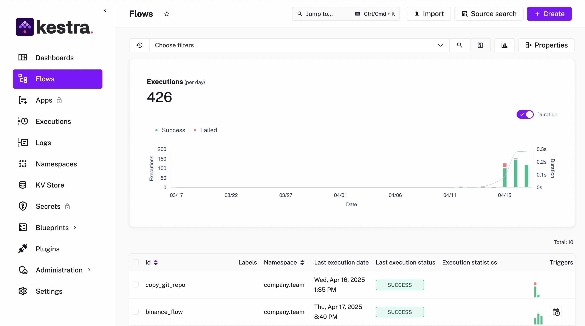
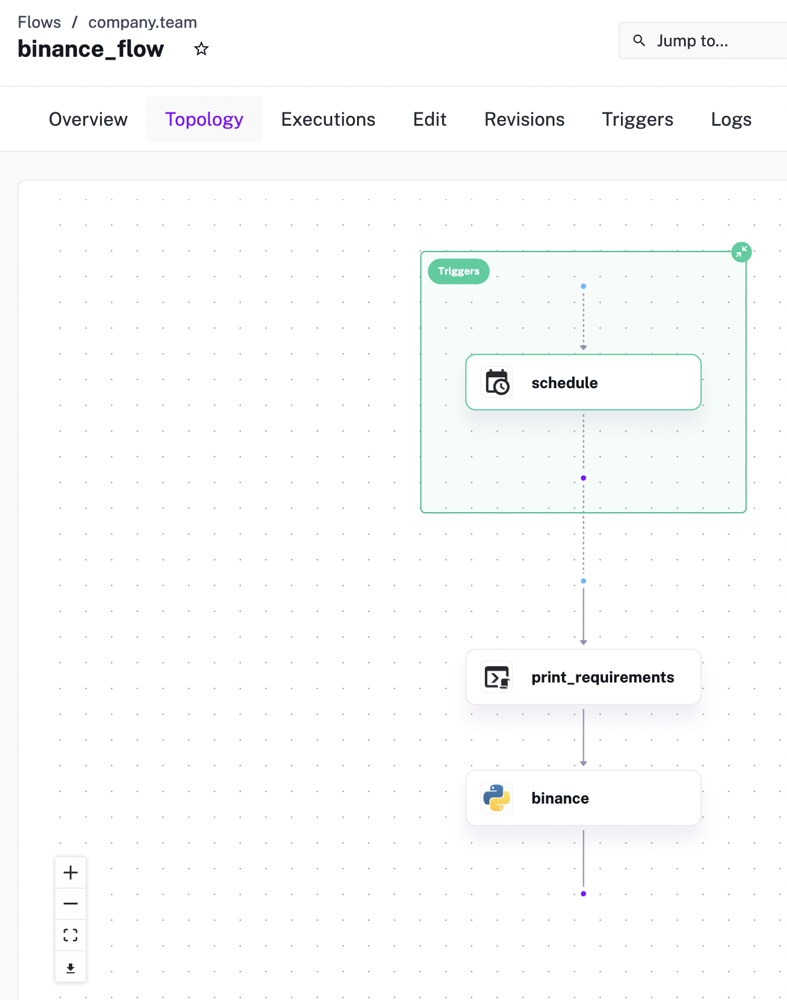
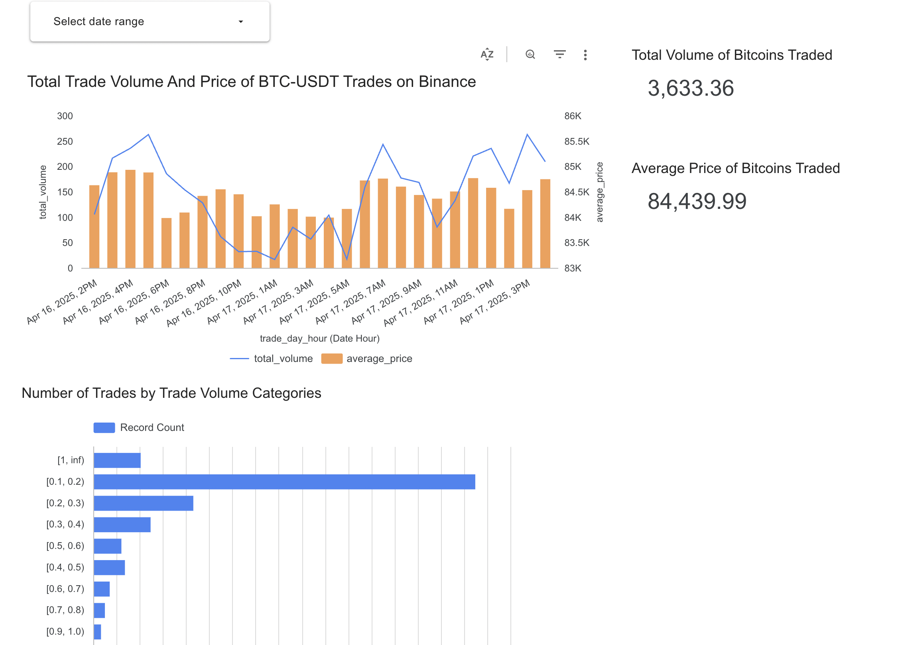

de_zoomcamp_2024_UCL_2016-2022

# The final project for DE Zoomcamp 2024

## Problem description:
While there is an abundance of data on Bitcoin prices available online, detailed representations of this data are less common. In this project, I used the Binance API – specifically the Market Data Endpoint – to retrieve in-depth information on the volume and number of trades between Bitcoin and USDT. This approach provides a more nuanced understanding of market behavior.

## Project Objective:
The primary objective of this project was to establish an end-to-end integration pipeline capable of collecting near real-time market data in a cloud-based environment that runs 24/7. Rather than relying on a local machine—which would require constant uptime and manual oversight—I chose to deploy the system on a Virtual Machine (VM) hosted on Google Cloud Platform (GCP).

By shifting to a cloud infrastructure, I ensured greater reliability, scalability, and long-term availability of the data collection process. The system was designed to be as autonomous as possible, with tasks automated to execute at regular 10-minute intervals. This eliminates the need for manual intervention and enables the pipeline to consistently capture up-to-date trading data. Ultimately, this setup provides a robust foundation for continuous data gathering and analysis, bringing us closer to a live market monitoring solution.

My personal goal was to practice skills on the data ingestion from an API Endpoint and making sure things run on a standard docker image (eventually one on Kestra). 

## Technologies
List of the tools used:

Compute Engine - to create a VM
Kestra - to build pipelines and trigger them contionuously
    Docker - created inside a Kestra task to run in a recreateable environment
    DLT - to get the data from Binance API and load to the GCS bucket
Terraform - to build GCP services
Google Cloud Storage - to store the data
Google BigQuery - to build the data tables/views for reporting 
Dbt cloud - to transform the data
Looker Data Studio - reporting



To copy the git repo:

```git clone https://github.com/compileandrun/deng25.git```

Then go to the Project folder.

Follow the 1.5.1 video from Data Engineering Zoomcamp [Youtube video](https://www.youtube.com/watch?v=ae-CV2KfoN0&list=PL3MmuxUbc_hJed7dXYoJw8DoCuVHhGEQb&index=14&ab_channel=DataTalksClub%E2%AC%9B).

After that make sure to install Kestra with:

```docker run --pull=always --rm -it -p 8080:8080 --user=root -v /var/run/docker.sock:/var/run/docker.sock -v /tmp:/tmp kestra/kestra:latest server local```

Install dlt python package

```pip install dlt```

### Service Account

### How the GCS BUcket looks like


### Bigquery

### Kestra
Kestra clones the same Project folder of this git repor first and saves those files to the Namespace. Then, it runs the python file called binance_flow.py which runs a dlt pipeline to store the json data file to the GCS bucket. This flow is triggered every 10 minutes and creates a new file in this bucket.


### DBT
DBT is used to create an external table from all the created files. Then, it also creates the structured data tables.
Dbt_external_tables package is installed. Check [here](https://hub.getdbt.com/dbt-labs/dbt_external_tables/latest/) for more info. 

### Looker Studi Report
[Public link](https://lookerstudio.google.com/u/1/reporting/4ac6e277-4d78-4f83-9940-6e87ae368f81/page/q8NHF)
It gets updated every 10 min (as long as I have credits in GCP)


Let me know if you have any questions or instructions are inadequate. Koray Kanut on the Slack group